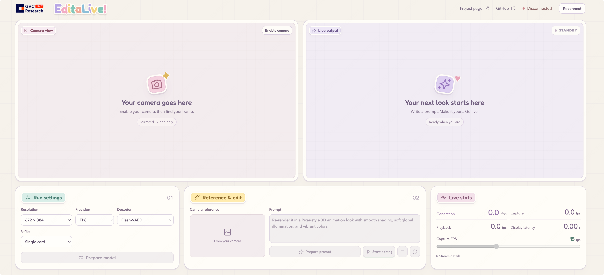

<div align="center">


<h2>Unified Character Video Editing for Live Streaming</h2>

#### [Zhiyuan Li<sup>1,3</sup>](https://huai-chang.github.io/) · [Chi-Man Pun<sup>1,📪</sup>](https://cmpun.github.io/) · [Peng-Tao Jiang<sup>2,📪</sup>](https://pengtaojiang.github.io/) · [Bo Li<sup>2</sup>](https://libraboli.github.io/) · [Xiaodong Cun<sup>3,🚩</sup>](https://vinthony.github.io/academic/)

<sup>1</sup> University of Macau &nbsp;&nbsp; <sup>2</sup> vivo BlueImage Lab &nbsp;&nbsp; <sup>3</sup> [GVC Lab, Great Bay University](https://gvclab.github.io/)

<sup>📪</sup> Corresponding authors &nbsp;&nbsp; <sup>🚩</sup> Project lead

<a href='https://arxiv.org/pdf/2608.27123'></a> 
<a href="https://huai-chang.github.io/EditaLive/"></a>
<a href='https://huggingface.co/huaichang/EditaLive'></a> 
<a href='https://www.modelscope.cn/models/huaichang/EditaLive'></a> 
[](https://github.com/GVCLab/EditaLive)


<video
  src="https://github.com/user-attachments/assets/5177ed40-6453-463a-a546-80c24e67baaf"
  controls
  style="max-width: 100%; display: block;">
</video>

</div>

## 📋 TODO

- [ ] If you find EditaLive useful or interesting, please give us a Star 🌟. Your support encourages us to keep improving the project.
- [ ] Fix bugs (If you encounter any issues, please feel free to open an issue or contact me! 🙏)
- [ ] Release `training code`.
- [ ] Enhance WebUI (Support custom reference image).
- [x] **[2026.09.14]** 🔥 Release `inference code`, `config`, and `pretrained weights`. Enjoy! 🏄
- [x] **[2026.08.27]** 🔥 Release `paper`.

## ⚖️ Disclaimer

- [x] This project is released for **academic research only**.
- [x] Users must not use this repository to generate harmful, defamatory, or illegal content.
- [x] The authors bear no responsibility for any misuse or legal consequences arising from the use of this tool.
- [x] By using this code, you agree that you are solely responsible for any content generated.

## ⚙️ Framework


## 🚀 Getting Started

### 🛠 Installation

```bash
# Clone this repo
git clone https://github.com/GVCLab/EditaLive.git
cd EditaLive

# Create conda environment
conda create -n editalive python=3.10 -y
conda activate editalive

# Install FFmpeg for preprocessing, audio, and comparison videos
conda install -c conda-forge ffmpeg -y

# Install packages with pip
pip install -r requirements.txt

# Install the flash-attn and fastvideo-kernel.
pip install ninja
pip install flash-attn==2.7.2.post1 --no-build-isolation
bash tools/install_fastvideo_kernel.sh
```

The FastVideo installer builds version 0.3.0 against the installed PyTorch,
including a compatibility fix for PyTorch 2.6. A CUDA toolkit (12.3+) and a
C++ compiler (GCC 10+) are required to build the kernels.

⚠️ For platform-specific requirements and troubleshooting, please follow the
official installation guides for [FlashAttention](https://github.com/Dao-AILab/flash-attention#installation-and-features)
and [FastVideo Kernel](https://github.com/hao-ai-lab/FastVideo/tree/main/fastvideo-kernel#installation).

### ⏬ Download weights

The provided script downloads [Wan2.2-Animate-14B](https://huggingface.co/Wan-AI/Wan2.2-Animate-14B),
the EditaLive LoRAs, and [Flash-VAED for Wan](https://huggingface.co/Aoko955/Flash-VAED/blob/main/models/wan/Flash_VAED_Wan.pth)
from Hugging Face into `./weights`:

```bash
python tools/download_weights.py
```

The EditaLive LoRAs are also available from the following mirrors:

<a href='https://drive.google.com/drive/folders/1KOk3_LLFtSRMgS-ztb89HYDODmgHrnb0?usp=sharing'></a> <a href='https://pan.baidu.com/s/1f0-FaNhd8A0BVvCYT0gl_Q?pwd=pLxq'></a> <a href='https://www.modelscope.cn/models/huaichang/EditaLive/tree/master/weights'></a> <a href='https://huggingface.co/huaichang/EditaLive/tree/main/weights'></a>

For manual downloads, place all three LoRA files in `./weights/EditaLive`.

After downloading, the directory layout should be:

```text
weights/
├── Wan-Animate/
├── EditaLive/
│   ├── editalive_edit.safetensors
│   ├── editalive_streaming.safetensors
│   └── lightx2v.safetensors
└── Flash-VAED/
    └── Flash_VAED_Wan.pth
```

### 🎞️ Inference

#### Input modes

EditaLive supports three input modes. Choose exactly one in each command:

| Mode | Argument | Use case |
|---|---|---|
| [Source video](#source-video) | `--video` | Preprocess and edit one raw video, with an optional reference image. |
| [Preprocessed root](#preprocessed-root) | `--folder` | Reuse an existing preprocessed source and skip preprocessing. |
| [JSON task file](#json-task-file) | `--input_json` | Process multiple videos or preprocessed sources with one model load. |

##### 1️⃣ Source video

Use `--video` for a raw source video. Add `--ref_image` to use a separate
character reference image; when it is omitted, the first frame of the source
video is used.

```bash
python edit_streaming.py \
  --ckpt_dir ./weights/Wan-Animate \
  --lora_paths \
    ./weights/EditaLive/editalive_edit.safetensors \
    ./weights/EditaLive/lightx2v.safetensors \
    ./weights/EditaLive/editalive_streaming.safetensors \
  --video ./demo/demo_1.mp4 \
  --prompt "Transform it into a soft plush-like aesthetic with smooth textures and gentle shading." \
  --frame_num -1 \
  --enable_compile False \
  --fast_decode False \
  --save_dir ./outputs_streaming
```


##### 2️⃣ Preprocessed root

Use `--folder` to skip preprocessing and load an existing preprocessed root.
The directory must contain `src_pose.mp4`, `src_face.mp4`, and `src_ref.png`.

```bash
python edit_streaming.py \
  --ckpt_dir ./weights/Wan-Animate \
  --lora_paths \
    ./weights/EditaLive/editalive_edit.safetensors \
    ./weights/EditaLive/lightx2v.safetensors \
    ./weights/EditaLive/editalive_streaming.safetensors \
  --folder ./demo/demo_1 \
  --prompt "Transform it into a soft plush-like aesthetic with smooth textures and gentle shading." \
  --frame_num -1 \
  --enable_compile False \
  --fast_decode False \
  --save_dir ./outputs_streaming
```


##### 3️⃣ JSON task file

Use `--input_json` to process one or more tasks sequentially with a single
model load. Each JSON entry can specify either `video` (with an optional
`ref_image`) or `folder`; see `demo/edit_causal.json` for an example.

```bash
python edit_streaming.py \
  --ckpt_dir ./weights/Wan-Animate \
  --lora_paths \
    ./weights/EditaLive/editalive_edit.safetensors \
    ./weights/EditaLive/lightx2v.safetensors \
    ./weights/EditaLive/editalive_streaming.safetensors \
  --input_json ./demo/edit_causal.json \
  --frame_num -1 \
  --enable_compile False \
  --fast_decode False \
  --save_dir ./outputs_streaming
```

The JSON example above can also be launched with `bash edit_causal.sh`.

👀 See [Inference Parameters](docs/INFERENCE_PARAMETERS.md) for inference options, defaults, constraints, and examples, and [Supported Edits](docs/SUPPORTED_EDITS.md) for tested editing capabilities and prompt templates.

⚡️ Add `--enable_compile True` to run the streaming loop under `torch.compile`: it is about **1.3× faster** at both 384×672 and 480×832 (measured on an H100). A run warms up only once no matter how many tasks `--input_json` holds, so batching tasks amortizes it. That cache lives in the system temporary directory; pass `--compile_cache_dir cache_path` to keep it somewhere persistent (~400 MB per configuration).

✂️ `--low_vram` trades speed for memory in two steps: `weights` streams the transformer blocks from CPU memory, and `weights+kv` also keeps the rolling KV cache there. Both produce exactly the same video as `off`. Measured on an H100 with `--fp8` and `--fast_decode True`, without `torch.compile` (the two are mutually exclusive):

| `--low_vram` | 384×672 | 480×832 |
|---|---|---|
| `off` | 31.4 GiB · baseline | 38.4 GiB · baseline |
| `weights` | 17.5 GiB · 1.02× slower | 24.5 GiB · 1.02× slower |
| `weights+kv` | 14.4 GiB · 1.71× slower | 15.0 GiB · 1.57× slower |

Streaming the blocks costs only a few percent — close to the run-to-run spread — because each transfer overlaps the previous block's compute; the KV cache step costs more because the whole cache moves on every denoising step. Without `--fp8` the weights double in size, so `weights` needs about 2 GiB more and runs slower.

### 📸 Online Inference

#### 📦 Setup Web UI

Complete the installation and weight download above, and install Node.js and npm.
Then run the following commands from the repository root:

```bash
pip install -r requirements-webcam.txt
cd webcam/frontend
npm ci
npm run build
cd ../..
```

#### ▶️ Start Streaming

Start the server on your GPU machine:

```bash
python edit_webcam.py --device 0 --host 127.0.0.1 --port 7860
```

Open `http://localhost:7860` in your browser. For a remote GPU server, run this
command on your local computer first:

```bash
ssh -N -L 7860:127.0.0.1:7860 <user>@<server>
```

Then open the same `http://localhost:7860` address locally. VS Code port forwarding
also works. Camera access requires localhost or HTTPS.

**How to use**:

1. In **Run settings**, choose Resolution (**672 × 384** or **832 × 480**),
   Precision, Decoder and GPUs, then click **Prepare model**. This loads, compiles
   and warms up the selected configuration; preparation progress appears in the UI.
2. Enter your edit instruction in **Prompt**, then click **Prepare prompt**.
3. Click **Enable camera**, drag or resize the crop to frame yourself, then click
   **Start editing**. A fresh camera frame becomes the reference, using the same
   crop as the live input. The camera preview and input are mirrored.

The current version supports landscape output and camera references.



#### ⚡ Runtime Options

- **FP8** and **Flash-VAED** are enabled by default. **BF16** and the original
  **Wan VAE** are also available.
- Select **Two cards** to run pose extraction and VAE encoding and decoding
  on a second GPU.
  The second device defaults to `--device + 1`; use `--second-device` to override it.
- **Capture FPS** sets the target camera upload rate (**8–25 fps**) and can be
  adjusted while running. Actual frame rate and latency depend on your GPU,
  camera and connection.

Compilation runs during **Prepare model**, with artifacts cached in
`.cache/compile/webcam/`. Changing Resolution, Precision, Decoder or GPUs requires
preparing the model again; changing Capture FPS does not.

Click **Reset** to stop generation and clear the session. You can then adjust the
crop or edit the prompt; after a prompt change, click **Prepare prompt** again.
Click **Start editing** to capture a new reference and generate from the beginning.
The model stays loaded across resets.

To exit completely and release GPU memory, close the browser tab and press
**Ctrl+C** in the server terminal. Closing the tab alone stops the session but
keeps the model loaded.

## 📝 Citation

If you find EditaLive useful for your research, welcome to cite our work using the following BibTeX:

```bibtex
@article{li2026editalive,
  title={EditaLive! Unified Character Video Editing for Live Streaming},
  author={Li, Zhiyuan and Pun, Chi-Man and Jiang, Peng-Tao and Li, Bo and Cun, Xiaodong},
  journal={arXiv preprint arXiv:2608.27123},
  year={2026}
}
```

## ❤️ Acknowledgement
This repository is mainly built upon [Wan-Animate](https://humanaigc.github.io/wan-animate/), [VideoX-Fun](https://github.com/aigc-apps/VideoX-Fun/), [LightX2V](https://github.com/modeltc/lightx2v), [FastVideo](https://github.com/hao-ai-lab/FastVideo/), and [Flash-VAED](https://github.com/Aoko955/Flash-VAED), thanks to their invaluable contributions.
