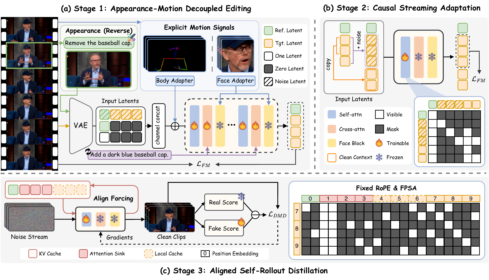
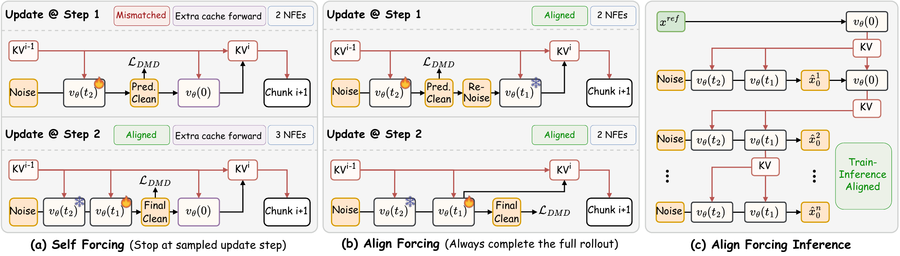

<div align="center">


<h2>Unified Character Video Editing for Live Streaming</h2>

#### [Zhiyuan Li<sup>1,3</sup>](https://huai-chang.github.io/) · [Chi-Man Pun<sup>1,📪</sup>](https://cmpun.github.io/) · [Peng-Tao Jiang<sup>2,📪</sup>](https://pengtaojiang.github.io/) · [Bo Li<sup>2</sup>](https://libraboli.github.io/) · [Xiaodong Cun<sup>3,🚩</sup>](https://vinthony.github.io/academic/)

<sup>1</sup> University of Macau &nbsp;&nbsp; <sup>2</sup> vivo BlueImage Lab &nbsp;&nbsp; <sup>3</sup> [GVC Lab, Great Bay University](https://gvclab.github.io/)

<sup>📪</sup> Corresponding authors &nbsp;&nbsp; <sup>🚩</sup> Project lead

<a href='https://arxiv.org/pdf/2608.27123'></a> 
<a href="https://huai-chang.github.io/EditaLive/"></a>
<a href='https://huai-chang.github.io/EditaLive/'></a> 
<a href='https://huai-chang.github.io/EditaLive/'></a> 
[](https://github.com/GVCLab/EditaLive)


<video
  src="https://github.com/user-attachments/assets/5177ed40-6453-463a-a546-80c24e67baaf"
  controls
  style="max-width: 100%; display: block;">
</video>

</div>

## 📋 TODO

- [ ] If you find EditaLive useful or interesting, please give us a Star 🌟. Your support encourages us to keep improving the project.
- [ ] We are doing our best to organize and polish the code for public release 🏃💨. Thank you for your interest and patience 🙏.
- [ ] Release `training code`.
- [ ] Release `inference code`, `config`, and `pretrained weights`.
- [x] **[2026.08.27]** 🔥 Release `paper`.

## ⚖️ Disclaimer

- [x] This project is released for **academic research only**.
- [x] Users must not use this repository to generate harmful, defamatory, or illegal content.
- [x] The authors bear no responsibility for any misuse or legal consequences arising from the use of this tool.
- [x] By using this code, you agree that you are solely responsible for any content generated.

## 🚀 Release Status

The code, pretrained weights, and detailed installation and inference instructions are being prepared for public release. Please watch this repository for updates.

## ⚙️ Framework




<!-- ## 📝 Citation

If you find PersonaLive useful for your research, welcome to cite our work using the following BibTeX:

```bibtex
@misc{li2026editalive,
  title  = {EditaLive! Unified Character Video Editing for Live Streaming},
  author = {Li, Zhiyuan and Pun, Chi-Man and Jiang, Peng-Tao and Li, Bo and Cun, Xiaodong},
  year   = {2026},
  url    = {https://editalive.github.io/}
}
``` -->

## ❤️ Acknowledgement
This repository is mainly built upon [Wan-Animate](https://humanaigc.github.io/wan-animate/), [VideoX-Fun](https://github.com/aigc-apps/VideoX-Fun/), [LightX2V](https://github.com/modeltc/lightx2v), and [FastVideo](https://github.com/hao-ai-lab/FastVideo/), thanks to their invaluable contributions.
